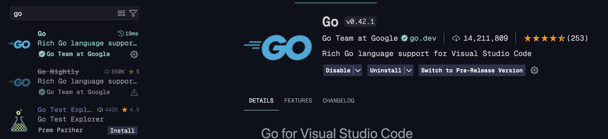

# PortGUIPhysics

## Setup

### Language (required)

- Install [GO(lang)](https://go.dev/doc/install)

### Editor + Extension (recommendation)

- Install [Visual Studio Code](https://code.visualstudio.com)

- Install the Golang language extension from the Extension pack



## Use

### Run in development mode

```
go run main.go
```

### Compile to binary

> Note: this command is building system specific binaries which will only work on the system being used for the compilation. For more information about cross-compiling refer to [Digital Ocean](https://www.digitalocean.com/community/tutorials/building-go-applications-for-different-operating-systems-and-architectures)

```bash
go build main.go

# windows
./main.exe

# mac/linux
./main
```

### TODO / Things we need to keep in mind

- Add log sanitizing dynamically
  otherwise we will face rendering issues if the min/max values aren't updated accordingly

- add checkbox stuff
- fix (re-implement) import data functionality
- implement basic minimizer

### Später

- add input lock
- add back-reference for minmax inputs (revalidate main input)
