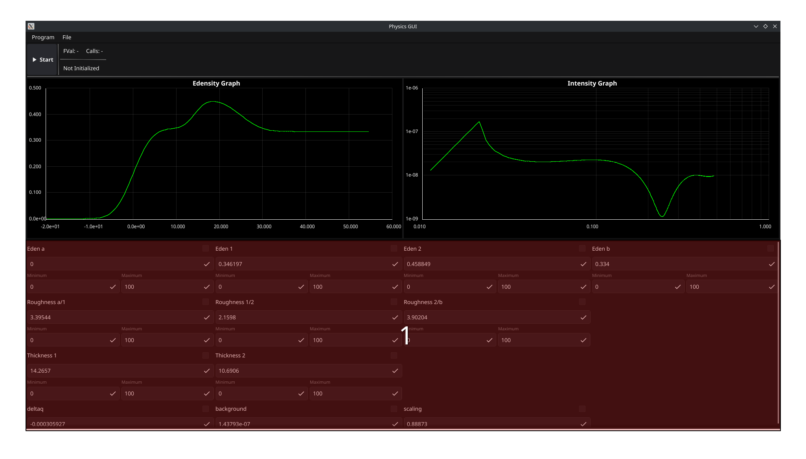
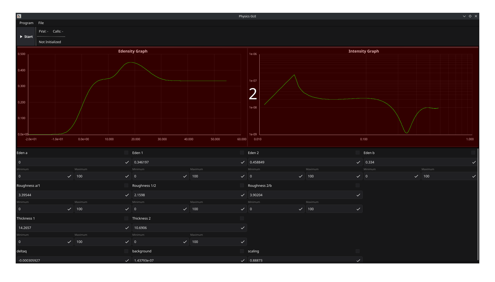
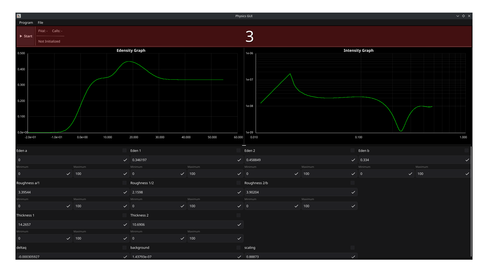
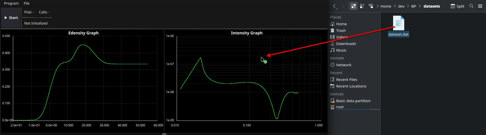

# SPIRIT - Scattering length Profile Integration and Reflectivity Iteration Tool

SPIRIT is a tool for analyzing X-ray and neutron reflectivity data to determine the scattering length density (SLD) profiles of thin films and interfaces. It allows you to fit experimental reflectivity data using a layer model approach, optimizing parameters like electron density, thickness, and roughness.

## Table of Contents

- [Installation](#installation)
- [Using SPIRIT](#using-spirit)
- [Customization Guide](#customization-guide)
- [Code Structure](#code-structure)
- [Technical Details](#technical-details)

## Installation

### Prerequisites

- [Go](https://go.dev/doc/install) (version >= 1.23.3)

### Recommended Tools

- Install [Visual Studio Code](https://code.visualstudio.com)
When you open the project folder it will ask you if it should install a go extension. Let it do that.

- Install the Golang language extension from the Extension pack


- Install [GCC] (https://docs.fyne.io/started/)
Therefore follow the instructions before the "Downloading" section.

On Windows systems also...
- Install [Git](https://git-scm.com/downloads/win)
Use the preselected options of the installation wizard

### Building and Running

There are two ways to run SPIRIT:

#### Development Mode
```bash
go run main.go
```

#### Compiled Binary
```bash
# Build the application
go build -o spirit

# Run the compiled binary
# On Windows:
./spirit.exe

# On macOS/Linux:
./spirit
```

## Using SPIRIT

### Interface Overview

The SPIRIT interface consists of several main components:

1. **Parameter Controls**: Input fields for model parameters, organized by category
   
2. **Data Visualization**: Graphs showing the experimental data and model fits
   
3. **Minimization Controls**: Options for fitting the model to experimental data
   

### Loading Data

1. Experimental data can be loaded by dragging and dropping data files onto the Graph area
   


Supported data format is a space/tab-delimited text file with three columns:
- Q-value (momentum transfer)
- Reflectivity
- Error

The first line of the file should contain a single integer indicating the number of data points.

### Parameter Groups

Parameters are organized into functional groups, for example:

- **Eden (Electron Density)**: Controls the SLD values for each layer
- **Thickness**: Controls the thickness of each layer in Ångströms
- **Roughness**: Controls the interfacial roughness between adjacent layers
- **General**: Controls overall parameters like background, scaling, and q-offset

Each parameter can be:
- Manually adjusted by typing values
- Set with minimum/maximum bounds for fitting
- Included/excluded from fitting using checkboxes

### Fitting Data

1. Set initial parameter values
2. Check the parameters you want to include in the fit (leave unchecked for fixed parameters)
3. Set minimum/maximum bounds for parameters if desired
4. Click the "Start" button to start the fitting process
5. Review the fit quality on the graphs

While `FVal` displays the error value and `Calls` gives the number of penalty function calls since the last update.

### Saving and Loading Parameters

You can save your current parameter settings and load them later:

- **Save**: File > Save
  - For JSON-Format use ".json" file extension
  - For XML-Format use ".xml" file extension 
  - All not supported extensions will be saved in the GOB-Format
- **Load**: File > Load
  - When loading JSON-Format make sure the files uses ".json" file extension
  - When loading XML-Format make sure the files uses ".xml" file extension
  - In All other formats, it is attempted to load them in GOB-Format

## Customization Guide

SPIRIT is designed to be customizable for different experimental setups. The main areas you might want to customize are:

### Changing the Number of Layers

To modify the number of layers in your model:

1. Open `pkg/gui/main.go`
2. Find the `registerParams()` function
3. Add or remove parameter entries for each layer group:

```go
// For a new layer, add parameters like:
eden3, _ := param.FloatMinMax("eden", "Eden 3", 0.458849)
thickness3, _ := param.FloatMinMax("thick", "Thickness 3", 10.0)
roughness23, _ := param.FloatMinMax("rough", "Roughness 2/3", 3.0)
roughness3B, _ := param.FloatMinMax("rough", "Roughness 3/b", 3.0)
```

4. Update the parameter container layout:

```go
containers := container.NewVBox(
    container.NewGridWithColumns(4, edenA, eden1, eden2, eden3, edenB),
    container.NewGridWithColumns(4, roughnessA1, roughness12, roughness23, roughness3B),
    container.NewGridWithColumns(4, thickness1, thickness2, thickness3),
    container.NewGridWithColumns(4, deltaQ, background, scaling),
)
```

5. Update the `minimize()` function to include new parameters:

```go
	edens := param.GetFloatGroup("eden")
	e1 := edens.GetParam("Eden a")
	e2 := edens.GetParam("Eden 1")
  //...

if err := minimize(e1, e2, e3, e4, e5, t1, t2, t3, r1, r2, r3, r4, delta, background, scaling); err != nil {
}
```

### Adding Custom Physics Calculations

To implement a different physical model:

1. Create a new file in the `pkg/physics` directory
2. Implement your model's calculations
3. Update the `RecalculateData()` function in `pkg/gui/main.go` to use your new calculations
4. Update the `penaltyFunction()` as described in the next step

Example for a new physical model:

```go
// In pkg/physics/<mymodel>.go
package physics

func MyModelCalculation(parameters []float64) function.Points {
    // Your physics model implementation here
    return points
}

// Then in pkg/gui/main.go, update RecalculateData() to call your function
myModelPoints := physics.MyModelCalculation(parameterArray)
functionMap["<mymodel>"].SetData(myModelPoints)
```

### Modifying the Penalty Function

The penalty function determines how the difference between model and data is calculated:

1. Open `pkg/gui/main.go`
2. Find the `penaltyFunction()` function
3. Modify how the error is calculated:

```go
	// ...
  // Calculate model data
	intensityPoints := physics.CalculateIntensityPoints(edenPoints, deltaErr, &physics.IntensityOptions{
		Background: backgroundErr,
		Scaling:    scalingErr,
	})
  // fetch experimental data they need to be compared to
	experimentalData := graphMap["intensity"].GetDataTracks()
	dataTracks := make([]function.Points, len(experimentalData))
	for i, dataTrack := range experimentalData {
		dataTracks[i] = dataTrack.GetData()
	}

	//penalty calculation, simple sum right now
  // go to `pkg/gui/physics/intensity.go` to change it (for example use weights)
	diff, err := physics.Sim2SigRMS(dataTracks, intensityPoints)
```

### Changing the Minimization Algorithm
SPIRIT makes use of the `Minuit2Go` [package](https://github.com/empack/minuit2go) for minimization, 
which uses the Minuit2 algorithm by default, but you can use other algorithms:

1. Open `pkg/gui/main.go`
2. Find the `minimize()` function
3. Replace the Minuit2 implementation with another algorithm or library

For small changes, you might modify parameters of the existing algorithm:

```go
// Update the strategy (more precise but slower)
migrad2 := minuit.NewMnMigradWithParameterStateStrategy(mFunc, min.UserState(), 
    minuit.NewMnStrategyWithStra(minuit.PreciseStrategy))
```

For completely different algorithms, you'd need to implement a new minimizer interface.

If you make changes to the minimizer, make sure you know what you are doing.

**We encourage the use of Minuit2Go.**

## Code Structure

The SPIRIT codebase is organized into several packages:

- `pkg/data`: Data parsing and handling
- `pkg/function`: Function representation and manipulation
- `pkg/gui`: GUI components and application logic
  - `pkg/gui/graph`: Graph rendering
  - `pkg/gui/param`: Parameter handling
  - `pkg/gui/helper`: Utility functions
- `pkg/minimizer`: Optimization algorithms
- `pkg/physics`: Physics calculations
- `pkg/trigger`: Event handling

Key files to understand:

- `main.go`: Application entry point
- `pkg/gui/main.go`: Main GUI setup and customization
- `pkg/physics/eden.go`: Electron density profile calculation
- `pkg/physics/intensity.go`: Reflectivity calculation
- `pkg/minimizer/minuit_minimizer.go`: Interface to Minuit2 minimization

## Technical Details

### The Parameter System

Parameters are managed through a flexible system:

- Parameters are organized into groups by type (e.g., "eden", "thick", "rough")
- Each parameter has optional min/max bounds
- Parameters can be toggled for inclusion in fitting
- Changes to parameters trigger recalculation through the trigger system

### The Graph System

Graphs are rendered using the Fyne toolkit:

- Multiple graph types can be displayed (eden profile, intensity)
- Data can be plotted in linear or logarithmic scale
- Experimental data can be overlaid for comparison

### Calculation Flow

When parameters change, the following happens:

1. `trigger.Recalc()` is called
2. This triggers the `RecalculateData()` function in `pkg/gui/main.go`
3. Parameters are fetched using the parameter system
4. Physical calculations are performed (eden profile, intensity)
5. Results are set to functions that are displayed in graphs
6. Graphs are automatically refreshed

### Minimization Process

When fitting is requested:

1. Parameters marked for fitting are collected
2. A Minuit function is created that calculates the penalty
3. The minimizer iteratively adjusts parameters to reduce the penalty
4. Updated parameters are displayed in the GUI
5. Graphs are refreshed to show the new fit

---